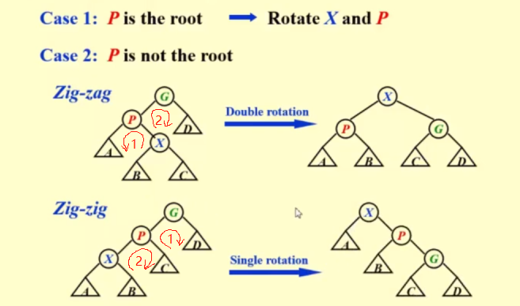

# Advanced Data Structures and Algorithm Analysis

## 1 AVL tree, Splay tree, Amortized analysis

### 1.1 AVL Trees

Target: Speed up searching (with insertion and deletion, Dynamic Searching)

Definition: An empty binary tree is height balanced (The height of an empty tree is defined to be -1, means `N(-1) = 0, N(0) = 1`). If `T` is a nonempty binary tree with `Tl` and `Tr` as its left and right subtree, then `T` is height balanced iff(if and only if):
1. `Tl` and `Tr` are height balanced (recursive definition), and
2. `|hl - hr| <= 1` where `hl` and `hr` are the heights of `Tl` and `Tr`, respectively.

Definition: The balance factor `BF = hl - hr`. In an AVL tree, BF = -1, 0 or 1.

rotation: RR, LL, LR, RL

LR can be considered as the combination of two single rotations (RR & LL). So it's also called a double rotation.

Let `Nh` be the minimum number of nodes in a height balanced tree of height `h`. Then the tree must be `Nh = Nh-1 + Nh-2 + 1`.

### 1.2 Splay Trees

Target: Any `M` consecutive tree operations starting from an empty tree take at most `O(M logN)` time.

Idea: After a node is accessed, it is pushed to the root by a series of AVL tree rotations.

Splaying not only moves the accessed node to the root, but also roughly halves the depth of most nodes on the path.

Rotation:
* P is the root:
    1. zig: single rotation
* P is not the root:
    1. zig-zag: double rotation
    2. zig-zig: single rotation

Deletion:
1. Find X
2. Remove X
3. FindMax(`Tl`)
4. Make `Tr` the right child of the root of `Tl`.

Splay tree is like a simplified version of AVL tree, which doesn't care about what balancing is. Its performance is as good as an AVL tree.

### 1.3 Amortized Analysis

worst-case bound >= amortized bound >= average-case bound
> not greater than or equal to, but stronger than

There is no probability is involved with amortized bound.

It's stronger than the so called average-case bound while we have to assume some probability distributions.

**Methods:**
1. Aggregate analysis
2. Accounting method
3. Potential method

**Aggregate analysis**

Idea: Show that for all `n`, a sequence of `n` operations takes `worst-case` time `T(n)` in total. In the worst case, the average cost, or amortized cost, per operation is therefore `T(n)/n`.

**Accounting analysis**

Idea: When an operation's amortized cost `c'i` exceeds its actual cost `ci`, we assign the difference to specific objects in the data structure as credit. Credit can help pay for later operations whose amortized cost is less than their actual cost.

**Potential analysis**

Idea: Potential function

## 2 Red-Black Trees and B+ Trees

### 2.1 Red-Black Trees: Definition

Target: Balanced binary search tree

Definition: A `red-black` tree is a binary search tree that satisfies the following red-black properties:
1. Every node is either red or black.
2. The root is black.
3. Every leaf (NIL) is black.
4. If a node is red, then both its children are black.
5. For each node, all simple paths from the node to descendant leaves contain the same number of black nodes.

Definition: The `black-height` of any node x, denoted by bh(x), is the number of black nodes on any simple path from x (x not included) down to a leaf. bh(Tree) = bh(root).

Lemma: A red-black tree with N internal nodes has height at most `2ln(N+1)`.

Proof:
1. For any node x, sizeof(x) >= 2^(bh(x)) - 1.
    > `sizeof` means number of internal nodes in the subtree rooted at x. Prove by induction (归纳法证明).
2. bh(Tree) >= h(Tree) / 2.
    > Since for every red mode, both of its children must be black, hence on any simple path from root to a leaf, at least half the nodes (root not included) must be black.

Lemma: In a Red-Black tree, the path from the root to the farthest leaf is no more than twice as long as the path from the root to the nearest leaf.

### 2.2 Red-Black Trees: Operations

* insert
    1. When we make an insertion, first colored the new node red. If the number of black nodes is not changed, we don't have to do anything to re-balance the tree.
    2. The overall performance is basically the same as what we have in an AVL tree.

* delete
    * Delete a leaf node: reset its parent link to NIL. Adjust only if the node is black.
    * Delete a degree 1 node: replace the node by its single child.
    * Delete a degree 2 node:
        1. replace the node by the largest one in its left subtree or the smallest one in its right subtree (Keep the color).
        2. delete the replacing node from the subtree.

Must add 1 black to the path of the replacing node.

## 6 Backtracking 回溯法

A sure-fire way to find the answer to a problem is to `make a list of all candidate answers, examine each`, and following the examination of all or some of the candidates, declare the identified answer.

Backtracking enables us to `eliminate` the explicit examination of `a large subset` of the candidates while still guaranteeing that the answer will be found if the algorithm is run to termination.

### 6.2 Eight Queens

## 7 Divide and Conquer 分治法

Recursively:
    **Divide** the problem into a number of sub-problems
    **Conquer** the sub-problems by solving them recursively
    **Combine** the solutions to the sub-problems into the solution for the original problem

### 7.1 Closest Points

Sort according to x-coordinates and divide;
Conquer by forming a solution from left, right and cross.

`T(N) = 2T(N/2) + cN`

1. Substitution
2. Recursion-Tree
3. Master method

## 8 Dynamic Programing 动态规划

Solve sub-problems just once and save answers in a table.

Use a table instead of recursion (Time-Space Tradeoff)

### 8.1 Fibonacci Number

Trouble maker: The growth of redundant calculations is explosive.
Solution: Record the two most recently computed values to avoid recursive calls.

`F(n) = F(n - 1) + F(n - 2)`

~~~ c
int Fibonacci(int n)
{
    int i, last, nextToLast, Answer;

    if (n <= 1)
        return 1;

    last = nextToLast = 1;

    for (i = 2; i <= n; i++) {
        answer = last + nextToLast;
        nextToLast = last;
        last = answer;
    }

    return answer;
}
~~~

### 8.2 Ordering Matrix Multiplications

### 8.5 Product Assembly

* How to design a DP method
    1. Characterize an optimal solution
        * An optimal solution contains an optimal solution of a sub-problem.
    2. Recursively define the optimal values
        * An optimal path to stage is based on an optimal path to (stage - 1).
    3. Compute the values in some order
    4. Reconstruct the solving strategy

### 8.6 Summary

Element of DP:
    * Optimal substructure
    * Overlapping sub-problems

When can't we apply dynamic programming?
    * History dependency if sub-problems do not overlap

## 9 Greedy Algorithms

