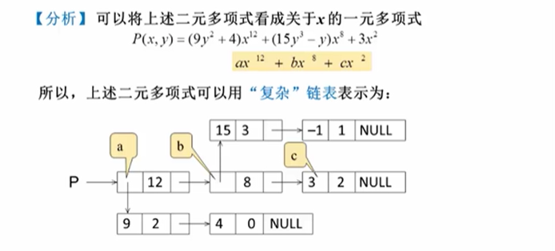
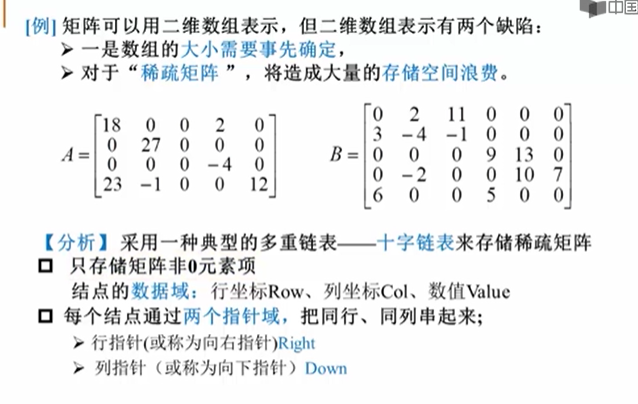
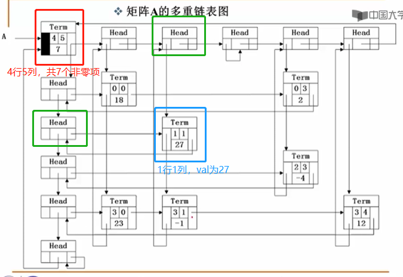
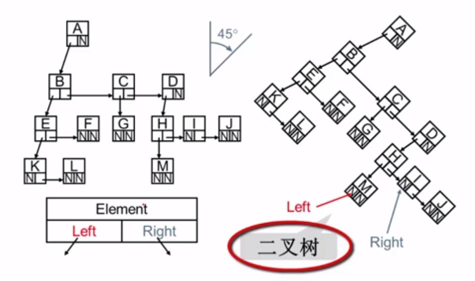
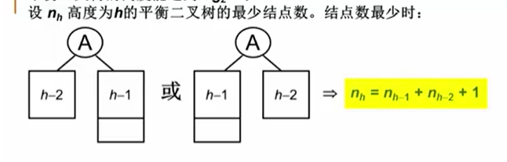
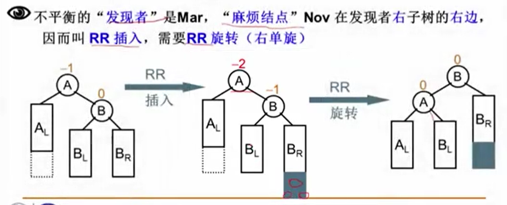
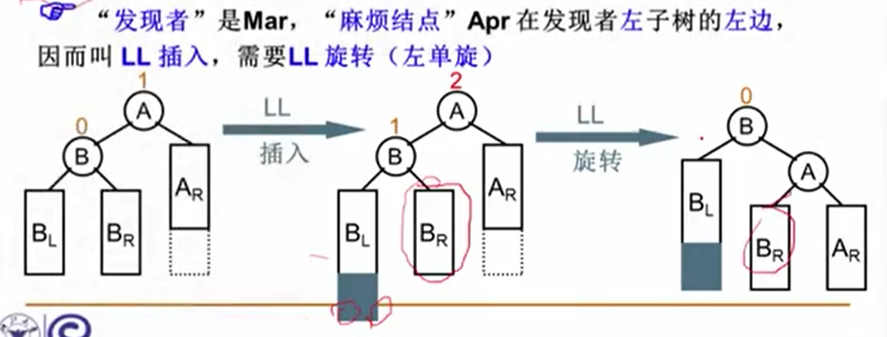
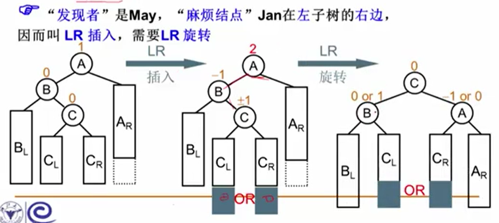
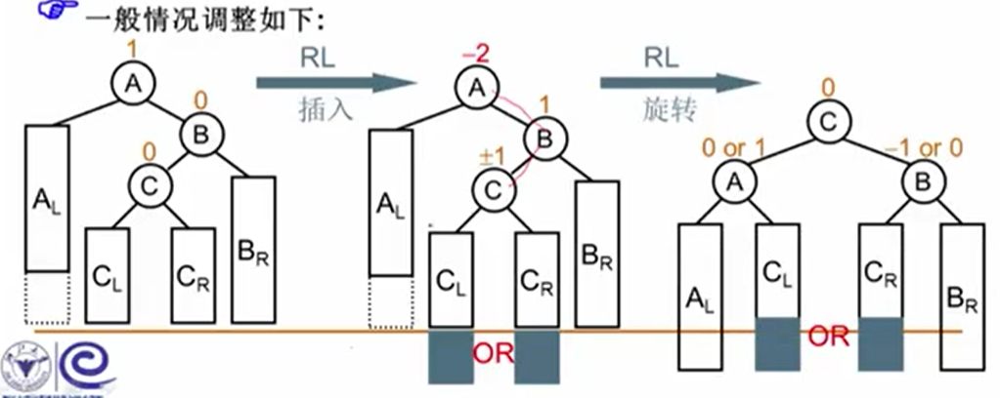

# 数据结构

## 1 基本概念

* 渐进复杂度
    - 1
    - logN
    - N
    - N * logN
    - N^2
    - N^3
    - 2^N
    - N!

## 2 线性结构

### 2.1 线性表及其实现

* 广义表

* 广义表是线性表的推广
* 广义表中的元素不仅可以是单元素也可以是另一个广义表

~~~ C
struct Gnode {
    int tag;	// 0 means data, 1 means subList
    union {
        elementType data;
        struct Gnode *subList;
    } uRegion;
    struct Gnode *next;
};
~~~

* 多重链表

~~~ C
// 抽象类型
struct multi_linked {
    struct multi_linked *down;
    union uRegion;
    struct multi_linked *right;
};

struct TermData {
    int row;
    int col;
    int val;
};
// Term
struct multi_linked_node {
    struct multi_linked_node *down;
    union {
        struct TermData data;
        struct head *next;
    } uRegion;
    struct multi_linked_node *right;
};
// Head
struct head {
    struct multi_linked_node *down;
    union {
        struct TermData data;
        struct head *next;
    } uRegion;
    struct multi_linked_node *right;
};
~~~

### 2.2 堆栈 stack

### 2.3 队列 queue

## 3 树

### 3.1 树的术语

* 一棵拥有 N 个结点的树，有(N - 1)条边
* 结点的度：结点的子树个数
* 树的度：树的所有结点中最大的度数
* 叶结点：度为0的结点
* 结点的层次：规定根结点在1层，其他任一结点的层数是其父结点的层数加一
* 树的深度：树中所有结点中的最大层次是这棵树的深度

- 儿子兄弟表示法

~~~ C
struct tree_node {
    struct tree_node *firstChild;
    struct tree_node *nextSibling;
};
~~~

- 任意一棵树都可以通过儿子兄弟表示法，使用二叉树来实现

### 3.2 二叉树的存储结构

- 顺序存储结构
    * 完全二叉树，父节点[i/2]，左孩子[2*i]，右孩子[2*i + 1]
    * 一般二叉树也可以，但会造成空间浪费

- 链表存储

### 3.3 二叉树的遍历

* 前序/中序/后序遍历
* 层序遍历

### 3.4 二叉搜索树

* 非空左子树所有键值小于其根结点的键值
* 非空右子树所有键值大于其根结点的键值
* 左右子树都是二叉搜索树

- 操作函数：
    * find
    * findMin
    * findMax
    * insert
    * delete:
        1. 该结点左右子树皆为空，直接删除
        2. 该结点只有一个儿子，用儿子结点直接替换
        3. 该结点有两个儿子，实质是使用左子树最大值或者右子树最小值替换被删除结点，递归删除该左子树最大值/右子树最小值结点

### 3.5 平衡二叉树

* Balance Factor: 任意结点左右子树高度差的绝对值不超过1
* 一颗高度为 h 的平衡二叉树，最少结点数为 Nmin(h) = Nmin(h-1) + Nmin(h-2) + 1

* 平衡二叉树的调整
    - RR旋转（麻烦结点在发现者的右子树的右边）
    

    - LL旋转（麻烦结点在发现者的左子树的左边）
    

    - LR旋转（麻烦结点在发现者的左子树的右边）
    

    - RL旋转（麻烦结点在发现者的右子树的左边）
    

### 3.6 堆

* 大顶堆/小顶堆，属于完全二叉树，堆的路径呈现单调性
* 堆操作

~~~
create
IsFull
IsEmpty

Insert
DeleteMax
~~~

* create heap 如果使用 insert 方法，时间复杂度 O(n * logn)，最坏情况是各结点的高度之和

### 3.7 哈夫曼树 Huffman Tree

* WPL（带权路径长度）：设二叉树有n个叶子结点，每个叶子结点带有权值W(k)，从根结点到每个叶子结点的长度为l(k)，则每个叶子结点的带权路径长度之和 WPL = Sum(W(k) * l(k))

* WPL 最小的二叉树 即是 哈夫曼树

* 每次把权值最小的两棵二叉树合并

* 特点：
    - 没有度为1的结点
    - n 个叶子结点的哈夫曼树共有 2n-1 个结点
    - 哈夫曼树的任意非叶子节点的左右子树交换后仍是哈夫曼树
    - 对同一组权值，存在不同构的哈夫曼树

### 3.8 哈夫曼编码

* 不等长编码避免二义性：任何字符的编码都不是另一字符编码的前缀(prefix code), 可使用 trie tree 进行前缀检查

* 用二叉树进行编码：
    1. 左右分支：0, 1
    2. 字符只在叶子结点上

* 特点：
    1. 最优编码，WPL 最小
    2. 无歧义解码，前缀码：数据仅存于叶子结点
    3. 1 & 2 推导出没有度为1的结点（反证法）

### 3.9 并查集

* 集合操作，其中关注：并集操作，查找操作
* 双亲表示法
* 集合操作：

~~~
Find
Union
~~~

* Union 为了改善合并以后的查找性能，可以采用小的集合合并到相对大的集合中，按秩归并，最坏情况下的树高：O(logN)
* Find 为了改善查找性能，采用**路径压缩**思路

## 4 图 graph

### 4.1 定义

* 表示**多对多**的关系

* 包含：
    1. 一组顶点：通常用 V(Vertex) 表示顶点集合
    2. 一组边：通常用 E(Edge) 表示边的集合
        * (v, w) 表示无向边
        * <v, w> 表示有向边，v -> w
        * 不考虑重边和自回路

* 操作集：

~~~
create
insertVertex
insertEdge
DFS
BFS
shortestPath
MST(minimum spanning tree)
~~~

### 4.2 图的表示

* 邻接矩阵

好处：
    1. 无向图：对应行/列非0元素的个数
    2. 有向图：对应行非0元素的个数是 “出度” ，对应列非0元素的个数是 “入度”

~~~
G[i][j] =   1 (若 <Vi, Vj> 是 G 中的边)
            0 (否则)
~~~

缺点：
    1. 浪费空间，存稀疏图（点很多而边很少）有大量无效元素
    2. 浪费时间，稀疏图

* 邻接表

好处：
    1. 节约稀疏图的空间（需要N个头指针 + 2E个结点（每个结点至少2 fields））

### 4.3 图的遍历

* DFS & BFS 复杂度：
    1. 邻接表存储，则 O(N + E)
    2. 邻接矩阵存储，则 O(N * N)

~~~ C
void DFS(Vertex V)
{
    visited[V] = true;

    for (V 的每个邻接点 W)
        if (!visited[W])
            DFS(W);
}
~~~

~~~ C
void BFS(Vertex V)
{
    visited[V] = true;
    Enqueue(V, Q);

    while (!IsEmpty(Q)) {
        V = Dequeue(Q);
        for (V 的每个邻接点 W) {
            if (!visited[W]) {
                visited[W] = true;
                Enqueue(W, Q);
            }
        }
    }
}
~~~

### 4.4 图的连通

连通：如果从 V 到 W 存在一条（无向）路径，则称 V 和 W 是连通的

路径：V 到 W 的路径是一系列顶点 {V, v1, v2, ..., vn, W} 的集合，其中任一对相邻的顶点间都有图中的边。路径的长度是路径中的边数（如果带权，则是所有边的权重和）。

如果 V 到 W 之间的所有顶点都不同，则称简单路径。

回路：起点等于终点的路径。

连通图：图中任意两顶点均连通。

连通分量：无向图的极大连通子图
    * 极大顶点数：再加1个顶点就不连通了
    * 极大边数：包含子图中所有顶点相连的所有边

强连通：有向图中顶点 V 和 W 之间存在双向路径，则称 V 和 W 是强连通的

强连通图：有向图中任意两顶点均强连通

强连通分量：有向图的极大强连通子图

~~~ C
void ListComponents(Graph G)
{
    for (each V in G)
        if (!visited[V])
            DFS(V); // or BFS(V);
}
~~~

### 4.5 图的最短路径问题

* 在网络中，求两个不同顶点之间的所有路径中，边的权值之和最小的那一条路径(shortest path)

#### 4.5.1 单源最短路径问题

* **单源**最短路径问题：从某固定源点出发，求其到所有其他顶点的最短路径

#### 4.5.1.1 无权图

* 无权图的单源最短路径算法：BFS, 复杂度取决于存储方式 O(|V|+|E|) 邻接表 or O(|V|^2) 邻接矩阵
~~~ C
void Unweighted(Vertex S)
{
    Enqueue(S, Q);
    while (!IsEmpty(Q)) {
        V = Dequeue(Q);
        for (V 的每个邻接点 W) {
            // initialize dist & path as -1
            if (dist[W] == -1) {
                dist[W] = dist[V] + 1;
                path[W] = V;
                Enqueue(W, Q);
            }
        }
    }
}
~~~

#### 4.5.1.1 有权图

* 有权图的单源最短路径算法：
~~~ C
/* Dijkstra 不能解决有负边的情况 */
void Dijkstra(Vertex s)
{
    while (1) {
        V = 未收录顶点中，dist最小者;
        if (V 不存在)
            break;

        collected[V] = true;
        for (V 的每个邻接点 W) {
            if (collected[W] == false) {
                if (dist[V] + E<V, W> < dist[W]) {
                    // initialize dist[] as infinite & path[] as -1
                    dist[W] = dist[V] + E<V, W>;
                    path[W] = V;
                }
            }
        }
    }
}
~~~

* Dijkstra, 复杂度取决于扫描最小 dist 的方式：
    - 方法1：直接扫描所有未收录顶点 - O(|V|), T = O(|V|^2 + |E|) 对于稠密图效果好
    - 方法2：将dist存在最小堆中 - O(log|V|), 而更新 dist[w] 的值 - O(log|V|), T = O(|V| * log|V| + |E| * log|V|) = O(|E| * log|V|) 对于稀疏图效果好

* 类似问题：
    1. 要求数最短路径有多少条
        * count[s] = 1
        * 如果找到更短路：count[W] = count[V]
        * 如果找到等长路：count[W] += count[V]

    2. 要求边数最少的最短路
        * count[s] = 0
        * 如果找到更短路：count[W] = count[V] + 1
        * 如果找到等长路：count[W] = count[V] + 1

#### 4.5.2 多源最短路径问题

* **多源**最短路径问题：求任意两顶点间的最短路径

1. 方法1：直接将单源最短路径算法调用 |V| 遍, T = O(|V|^3 + |E|*|V|), 对于稀疏图效果好
2. 方法2：Floyd 算法, T = O(|V|^3), 对于稠密图效果好

~~~ C
void Floyd(void)
{
    for (i = 0; i < N; i++) {
        for (j = 0; j < N; j++) {
            // 邻接矩阵
            D[i][j] = G[i][j];
            path[i][j] = -1;
        }
    }

    for (k = 0; k < N; k++) {
        for (i = 0; i < N; i++) {
            for (j = 0; j < N; j++) {
                if (D[i][k] + D[k][j] < D[i][j]) {
                    D[i][j] = D[i][k] + D[k][j];
                    path[i][j] = k;
                }
            }
        }
    }
}
~~~

### 4.6 最小生成树问题 (Minimum Spanning Tree)

* 是一棵树
    + 无回路
    + V 个顶点一定有 V - 1 条边
* 是生成树
    + 包含全部顶点
    + V - 1 条边都在图里
* 边的权重和最小

**最小生成树存在** 意味着 **图连通**

#### 4.6.0 背景：贪心算法

贪：每一步都要最好

好：权重最小的边

约束条件：
1. 只能用图里有的边
2. 只能正好用掉 V - 1 条边
3. 不能有回路

#### 4.6.1 Prim 算法

* T = O(V^2)
* 稠密图比较合算

~~~
void Prim(Graph G)
{
    MST = {s};

    while (1) {
        V = 未收录顶点中 dist 最小者
        if (这样的 V 不存在)
            break;
        将 V 收录进 MST: dist[V] = 0

        for (V 的每个邻接点 W) {
            if (W 未被收录: dist[W] != 0) {
                if (E<v, w> < dist[W]) {
                    dist[W] = E<v, w>;
                    parent[W] = V;
                }
            }
        }
    }

    if (MST 中收的顶点不到 V 个)
        Error("MST is not exist")
}
~~~

#### 4.6.2 Kruskal 算法

* 将森林合并成树的过程
* T = O(E * logE)
* 稀疏图比较合算

~~~
void Kruskal(Graph G)
{
    MST = {};
    while (MST 中不到 V - 1 条边 && E 中还有边) {
        从 E 中取一条权重最小的边 E<v, w>    /* 最小堆 */
        将 E<v, w> 从 E 中删除
        if (E<v, w> 不在 MST 中构成回路)    /* 并查集，将森林合并成树的过程 */
            将 E<v, w> 加入 MST
        else
            彻底无视 E<v, w>
    }

    if (MST 中不到 V - 1 条边)
        Error("MST is not exist")
}
~~~

### 4.7 拓扑排序

* 拓扑序：如果图中从 V 到 W 有一条有向路径，则 V 一定排在 W 之前。满足此条件的顶点序列称为一个拓扑序。
* 获得一个拓扑序的过程就是拓扑排序。
* AOV(Activity on Vertex) 如果有合理的拓扑序，则必定是有向无环图(Directed Acyclic Graph, DAG)

~~~
void TopSort(void)
{
    for (cnt = 0; cnt < |V|; cnt++) {
        if (Indegree[V] == 0)
            Enqueue(V, Q);
    }

    while (!IsEmpty(Q)) {
        V = Dequeue(Q);
        输出 V，或者记录 V 的输出序号；
        cnt++;

        for (V 的每个邻接点 W) {
            if (--Indegree[W] == 0)
                Enqueue(W, Q);
        }
    }

    if (cnt != |V|)
        Error("图中有回路");
}
~~~

* T = O(|V| + |E|)
* 此算法可以用来检测有向图是否 DAG

### 4.8 关键路径问题

* AOE(Activity on Edge)，一般用于安排项目的工序
* 由绝对不允许延误的活动组成的路径，称为关键路径
* 问题类型：
    1. 整个工期有多长 `Earliest[0] = 0; Earliest[j] = max{Earliest[i] + C<i,j>}`
    2. 哪几个组有机动时间 `Latest[i] = min{Latest[j] - C<i,j>}; D<i,j> = Latest[j] - Earliest[i] - C<i,j>`
    3. 没有机动时间的路径，称为关键路径

## 5 排序

* 背景
    - 没有一种排序是任何情况下都表现最好的

* 稳定性：若经过排序，这些记录的相对次序保持不变，即在原序列中，r[i]=r[j]，且r[i]在r[j]之前，而在排序后的序列中，r[i]仍在r[j]之前，则称这种排序算法是稳定的

### 5.1 简单排序

* 冒泡排序
    + 最好情况：顺序 T = O(N)
    + 最坏情况：逆序 T = O(N^2)

~~~ c
void bubble_sort(int A[], int N)
{
    for (P = N - 1; P >= 0; P--) {
        flag = 0;

        for (i = 0; i < P; i++) {
            if (A[i] > A[i+1]) {
                swap(A[i], A[i+1]);
                flag = 1;
            }
        }

        if (flag == 0)
            /* already sorted, optimize */
            break;
    }
}
~~~

* 插入排序
    + 最好情况：顺序 T = O(N)
    + 最坏情况：逆序 T = O(N^2)

~~~ c
void insertion_sort(int A[], int N)
{
    for (P = 1; P < N; P++) {
        tmp = A[P];
        for (i = P; i > 0 && A[i - 1] > tmp; i--) {
            A[i] = A[i - 1];
        }
        A[i] = tmp;
    }
}
~~~

#### 5.1.1 时间复杂度下界

* 对于下标 i < j，如果 A[i] > A[j]，则称 (i, j) 是一对**逆序对**(inversion)
* 交换2个相邻元素正好消去1个逆序对
* 插入排序：T(N, I) = O(N + I) -- 如果序列基本有序，则插入排序简单且高效

* 定理：任意 N 个不同元素组成的序列平均具有 N*(N-1)/4 个逆序对
* 定理：任何仅以交换相邻两元素来排序的算法，其平均时间复杂度为 O(N^2)
* 这意味着：要提高算法效率，我们必须
    - 每次消去不止1个逆序对
    - 每次交换相隔较远的2个元素

### 5.2 希尔排序 Shell Sort

* 定义增量序列 D[m] > D[m-1] > ... > D[1] = 1
* 对每个 D[k] 进行间隔排序

~~~ c
void shell_sort(int A[], int N)
{
    for (D = N/2; D > 0; D /= 2) {  // Shell 增量序列

        // insertion sort
        for (P = D; P < N; P++) {
            tmp = A[P];
            for (i = P; i >= D && A[i - D] > tmp; i -= D) {
                A[i] = A[i - D];
            }
            A[i] = tmp;
        }
    }
}
~~~

* 最坏情况：T = O(N^2)
* 因为增量元素不互质，则小增量可能根本不起作用

* Hibbard 增量序列
    - D[k] = 2^k - 1 -- 相邻元素互质
    - 最坏情况：T = O(N^(3/2))

* Sedgewick 增量序列
    - D[k] = 9 * 4^k - 9 * 2^k + 1
    - Tavg = O(N^(7/6))
    - Tworst = O(N^(4/3))

### 5.3 堆排序 Heap Sort

* 选择排序
    - 无论如何：T = O(N^2)

~~~ c
void selection_sort(int A[], int N)
{
    for (i = 0; i < N; i++) {
        /* 从A[i]到A[N-1]中找最小元，并将其位置赋给MinPosition */
        /* 可优化 */
        MinPosition = ScanForMin(A, i, N - 1);

        /* 将未排序部分的最小元换到有序部分的最后位置*/
        Swap(A[i], A[MinPosition]);
    }
}
~~~

* 堆排序

* 需要额外空间

~~~ c
// T(N) = O(N * logN)
// space: O(N)
void Heap_sort_A(int A[], int N)
{
    /* O(N) */
    heapify(A);

    for (i = 0; i < N; i++) {
        /* O(logN) */
        tmp[i] = heappop(A);
    }

    /* O(N) */
    for (i = 0; i < N; i++) {
        A[i] = tmp[i];
    }
}
~~~

* 不需额外空间

~~~ c
// time: Tavg = 2*N*logN - O(N * loglogN) = O(N * logN)
// space: O(1)
void Heap_sort_B(int A[], int N)
{
    for (i = N/2; i >= 0; i--) {   /* Build Heap */
        // create Maxheap
        Percdown(A, i, N);
    }

    // swap first with last one
    // move max one to the last position
    for (i = N - 1; i > 0; i--) {
        swap(&A[0], &A[i]);
        Percdown(A, 0, i);
    }
}
~~~

### 5.4 归并排序 Merge Sort

* 核心：有序子列的归并
* 稳定

1. 递归算法
    * 分而治之
    * 无论如何：T(N) = O(logN * N)

~~~ c
void merge(int A[], int tmpA[], int L, int R, int RightEnd)
{
    /* 左边终点位置。假设左右两列挨着 */
    int LeftEnd = R - 1;

    /* 存放结果的数组的初始位置 */
    int cur = L;

    int NumElements = RightEnd - L + 1;

    while (L <= LeftEnd && R <= RightEnd) {
        if (A[L] <= A[R])
            tmpA[cur++] = A[L++];
        else
            tmpA[cur++] = A[R++];
    }

    /* 直接复制左边剩下的 */
    while (L <= LeftEnd)
        tmpA[cur++] = A[L++];

    /*直接复制右边剩下的 */
    while (R <= RightEnd)
        tmpA[cur++] = A[R++];

    for (i = 0; i < NumElements; i++, RightEnd--)
        A[RightEnd] = tmpA[RightEnd];
}

void MSort(int A[], int TmpA[], int L, int RightEnd)
{
    int Center;

    if (L < RightEnd) {
        Center = (L + RightEnd) / 2;
        MSort(A, TmpA, L, Center);
        MSort(A, TmpA, Center + 1, RightEnd);
        Merge(A, TmpA, L, Center + 1, RightEnd);
    }
}

void Merge_sort(int A[], int N)
{
    int *TmpA = malloc(N * sizeof(int));

    if (!TmpA)
        Error("空间不足");

    MSort(A, TmpA, 0, N - 1);
    free(TmpA);
}
~~~

2. 非递归算法

~~~ c
void Merge_pass(int A[], int TmpA[], int N, int length)
{
    /* length = 当前有序子列的长度 */
    for (i = 0; i <= N - 2 * length; i += 2 * length)
        merge(A, TmpA, i, i + length, i + 2 * length - 1);

    if (i + length < N) {
        /* 归并最后2个子列 */
        merge(A, TmpA, i, i + length, N - 1);
    } else {
        /* 最后只剩1个子列 */
        for (j = i; j < N; j++)
            TmpA[j] = A[j];
    }
}

void Merge_sort(int A[], int N)
{
    int length = 1; /* 初始化子序列长度*/
    int *TmpA = malloc(N * sizeof(int));

    if (!TmpA)
        Error("空间不足");

    while (length < N) {
        Merge_pass(A, TmpA, N, length);
        length *= 2;
        Merge_pass(TmpA, A, N, length);
        length *= 2;
    }
    free(TmpA);
}
~~~

### 5.5 性能比较

* 测试项：
    - 数据1：只有1个元素；
    - 数据2：11个不相同的整数，测试基本正确性；
    - 数据3：10^3 个随机整数；
    - 数据4：10^4 个随机整数；
    - 数据5：10^5 个随机整数；
    - 数据6：10^5 个顺序整数；
    - 数据7：10^5 个逆序整数；
    - 数据8：10^5 个基本有序的整数；
    - 数据9：10^5 个随机正整数，每个数字不超过1000。

* 时间复杂度：单位 ms

| 测试项 | bubble | insertion | Shell | Shell Sedgewick | select  | heap  | merge |
| ------ | ------ | --------- | ----- | --------------- | ------- | ----- | ----- |
| 1      | 5 ms   | 16 ms     | 3 ms  | 8 ms            | 16 ms   | 3 ms  | 4 ms  |
| 2      | 4 ms   | 6 ms      | 4 ms  | 4 ms            | 10 ms   | 4 ms  | 6 ms  |
| 3      | 6 ms   | 6 ms      | 3 ms  | 5 ms            | 17 ms   | 4 ms  | 6 ms  |
| 4      | 155 ms | 40 ms     | 9 ms  | 11 ms           | 112 ms  | 9 ms  | 10 ms |
| 5      | TLE    | 1734 ms   | 62 ms | 39 ms           | 4727 ms | 40 ms | 35 ms |
| 6      | 42 ms  | 36 ms     | 42 ms | 43 ms           | 4792 ms | 35 ms | 32 ms |
| 7      | TLE    | 3325 ms   | 47 ms | 29 ms           | 4290 ms | 28 ms | 26 ms |
| 8      | 394 ms | 82 ms     | 22 ms | 35 ms           | 4836 ms | 39 ms | 27 ms |
| 9      | TLE    | 1729 ms   | 54 ms | 41 ms           | 4477 ms | 29 ms | 36 ms |

* 空间复杂度：单位 KB

| 测试项 | bubble  | insertion | Shell   | Shell Sedgewick | select  | heap    | merge   |
| ------ | ------- | --------- | ------- | --------------- | ------- | ------- | ------- |
| 1      | 200 KB  | 456 KB    | 196 KB  | 300 KB          | 172 KB  | 316 KB  | 192 KB  |
| 2      | 164 KB  | 188 KB    | 188 KB  | 192 KB          | 160 KB  | 176 KB  | 316 KB  |
| 3      | 192 KB  | 324 KB    | 200 KB  | 300 KB          | 192 KB  | 184 KB  | 292 KB  |
| 4      | 316 KB  | 324 KB    | 376 KB  | 312 KB          | 544 KB  | 444 KB  | 308 KB  |
| 5      | TLE     | 1160 KB   | 1196 KB | 1352 KB         | 1284 KB | 1216 KB | 1340 KB |
| 6      | 1212 KB | 1312 KB   | 1212 KB | 1344 KB         | 1180 KB | 1216 KB | 1332 KB |
| 7      | TLE     | 1176 KB   | 1208 KB | 1496 KB         | 1380 KB | 1212 KB | 1336 KB |
| 8      | 1276 KB | 1192 KB   | 1208 KB | 1216 KB         | 1192 KB | 1212 KB | 1336 KB |
| 9      | TLE     | 1176 KB   | 1084 KB | 960 KB          | 1052 KB | 964 KB  | 1088 KB |

### 5.6 快速排序

* 概述
    * 分而治之

~~~ c
void Quicksort(int A[], int N)
{
    if (N < 2)
        return;

    /* caution! */
    int pivot = 从 A[] 中选一个主元;

    /* caution! */
    将 S = { A[] \ pivot } 分成 2 个独立子集：
        A1 = { a belongs to S | a <= pivot };
        A2 = { a belongs to S | a >= pivot };

    A[] = Quicksort(A1, N1) V { pivot } V Quicksort(A2, N2);
}
~~~

* 选主元
    * A[0]
    * rand()
    * 取 head, mid, tail 的中位数

~~~ c
int Median3(int A[], int Left, int Right)
{
    int Center = (Left + Right) / 2;

    if (A[Left] > A[Center])
        swap(A[Left], A[Center]);
    if (A[Left] > A[Right])
        swap(A[Left], A[Right]);
    if (A[Center] > A[Right])
        swap(A[Center], A[Right]);
    /* A[Left] <= A[Center] <= A[Right] */

    swap(A[Center], A[Right - 1]);

    /* 只需考虑 A[Left + 1] ... A[Right - 2] */
    /* return pivot */
    return A[Right - 1];
}
~~~

* 子集划分
    * 交换元素，生成子集
    * 将 pivot 交换到正确位置
    * 如果有元素正好等于 pivot，停下来交换，否则可能导致子集不平衡

* 小规模数据处理
    * 对于 N < 100 可能还不如插入排序快
    * 当递归的数据规模充分小，则停止递归，直接调用简单排序（如插入排序）
    * 定义一个 cutoff 的阈值
