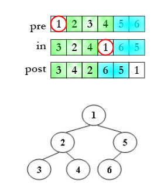

~~~ C
// pre-order length
// in-order length
// post-order length
void solve(int preL, int inL, int postL, int n)
{
    if (n == 0)
        return;
    if (n == 1) {
        post[postL] = pre[preL];
        return;
    }

    root = pre[preL];
    // last one
    post[postL + n - 1] = root;

    for (int i = 0; i < n; i++) {
        if (in[inL + i] == root)
            break;
    }
    L = i;
    R = n - L - 1;
    // left subtree & right subtree
    solve(preL + 1, inL, postL, L);
    solve(preL + 1 + L, inL + L + 1, postL + L, R);
}
~~~
